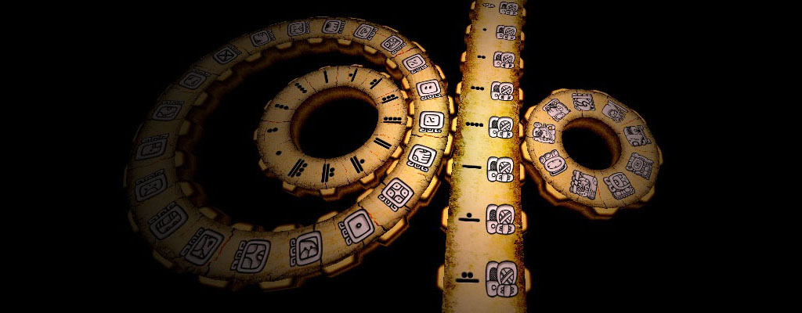
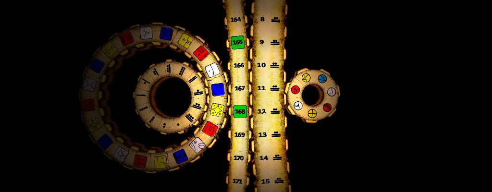

# Maya 3D &amp; Kin 3D

Greetings, Time Travellers!

**Maya 3D** was the first app I developed, released around 2009. Back then, game engines were not a thing like they are today, and people used to write code from scratch, with books and API reference. It was a challenging project, I had some years of development experience, but was new to Objective-C, had no knowledge of OpenGL, the iPhone was brand new (I actually developed on the cheaper iPod Touch), and never had devleoped and released a product all by myself before.

## What is the Maya Calendar?

**Maya 3D** was born form my passion of ancient history, archaeology and calendars. I was always fascinated by the [Ancient Maya Calendar](https://en.wikipedia.org/wiki/Maya_calendar), and with all the 2012 hype, I deep dived into it to understand how it works, and discovered it can be represented by moving gears, just like a clock. I tought that the just released iPhone, with it's beautiful touch screen display, would be the perfect device to visualize and browse it.

Download the official **Maya 3D** from the [App Store](https://itunes.apple.com/us/app/maya-3d/id318688264?ls=1&mt=8) or [maya3d.mobi](http://maya3d.mobi/)

Interestingly enough, there was a growing [community](https://lawoftime.org/) dedicated to a new, modern version of the Maya Calendar, called **Dreamspell**, or the **Thirteen Moons Calendar**, created by José Argüelles in 1987. It includes the same basic cycles of the Ancient Maya Calendar, added with the [Dreamspell](https://en.wikipedia.org/wiki/Dreamspell) philosophy, and uses a different correlation date. With the core app ready, I noticed I just had to "skin" it to be able to support the new calendar. And so I also made **Kin 3D**, a separated app to avoid confusion.

Download the official **Kin 3D** from the [App Store](https://itunes.apple.com/us/app/kin-3d/id435778989?ls=1&mt=88) or [kin3d.mobi](http://kin3d.mobi/)

## What can you do with this code?

It's been a decade!

Until today, those are my most downloaded apps. I often get very kind emails from the Dreamspell community asking for an Android build, or if the app will someday use the full graphics power of the iPad and iPad Pro. I was forced to update the apps a few times to be compatible with new iOSs, but  unfortunately can't afford the time to modernize and support different devices.

Thus, I'm releasing the source code in hopes that someone(s) could be interested in giving continuity to these apps. But I have some suggestions...

### Modernize

The apps are so iOS1! They could be modernized, with better UX/UI, high definition textures and a chilling soundscape. I would recommend to remake using html/css or some cross platform framework.

### Port to Android

You can't imagine how many people requested Android version... That would be a big challenge, since the apps were developed using Objective-C, the native MacOS/iOS language. The task is not just recompile for Android, but rebuild the whole app. But at least the Calendar classes would be easy to port, and all the information is here.

### Port to iPhone X / iPad / iPad Pro

It's impossible to modernize and not support iPhone X, iPad and iPad Pro, come on!

### The Master Time Plan

Add more calendars! Gregorian, Julian, Aztec, Chinese, Hebrew, Islamic, Persian, Aztec, the Sun, the Moon, the Solar System, all the visible Stars and the Milky Way. Everything is confined in cycles of time moving together. We could have one Master Time app connecting them all into one big galactic clock. Imagine that on the iPad Pro!

## What do I want in return?

The source code is released under the MIT Licence, which is very permissive and allow commercial use. But since the apps are free, and the research subject is universal, I don't think it's kind to just rebuild/remake and release the same app for profit.

If you release a new derivative app, I don't mind using the names **Maya 3D** and **Kin 3D** in the app name, but please add something to it, vary a little bit. And please give credits to **Studio Avante**.

I reserve the right to release updates to the official **Maya 3D** and **Kin 3D** apps (always free), using improvements made by the community.

## Have any questions?

Please open an [Issue](https://github.com/rsodre/Maya3D/issues).

## Credits

* Research, Design and Programming by Roger Sodré.
* Maya Tzolkin illustrations by Simone Sodré.
* Some Maya illustrations adapted from Mark Van Stone, John F. Harris and Stephen Stearns originals.
* Dreamspell illustrations by Jose Arguelles.
* Other illustrations by Roger Sodré.
* Spanish translation by Valentina Pineda Naranjo.
* Many thanks to Peter Meyer from [Hermetic Systems](https://www.hermetic.ch/). The information and softwares from his website were extremely helpful to understanding and validating the date conversion algorithms.
* Maya oracles condensed from many sources, impossible to identify at this moment.
* Dreamspell oracles gathered from different official [Thirteen Moon Calendar](http://www.lawoftime.org/thirteenmoon.html) editions.
